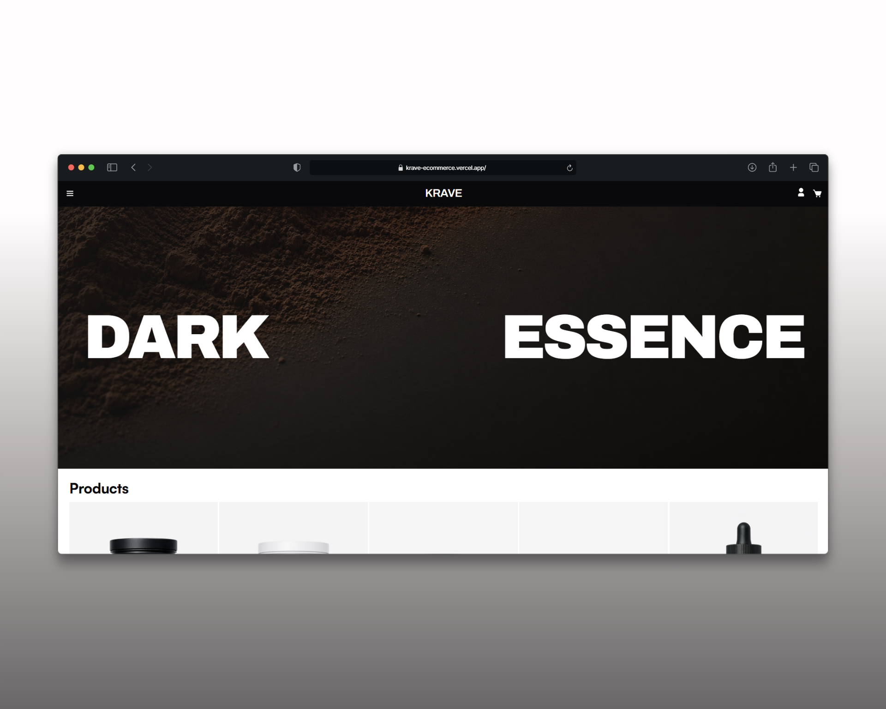
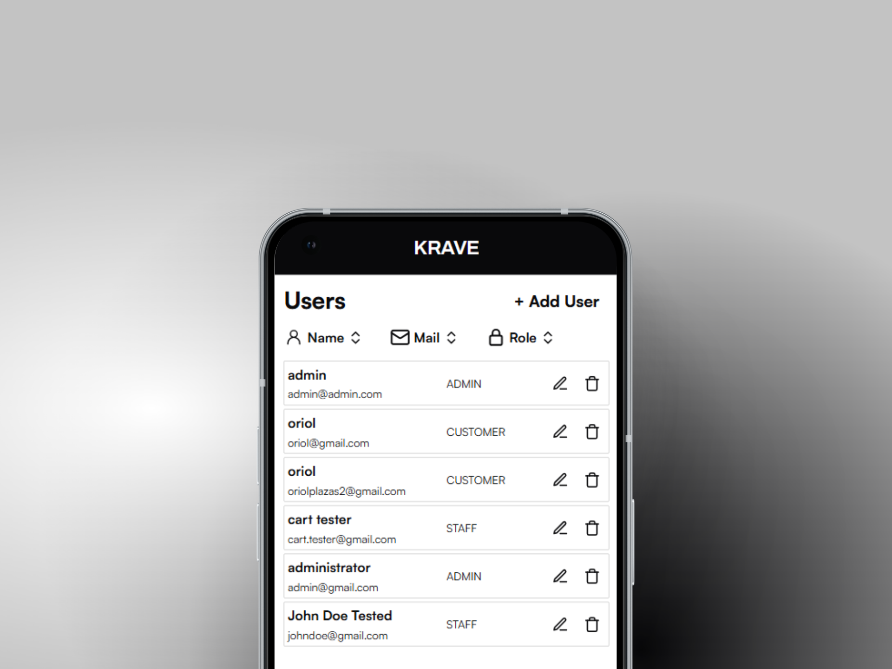
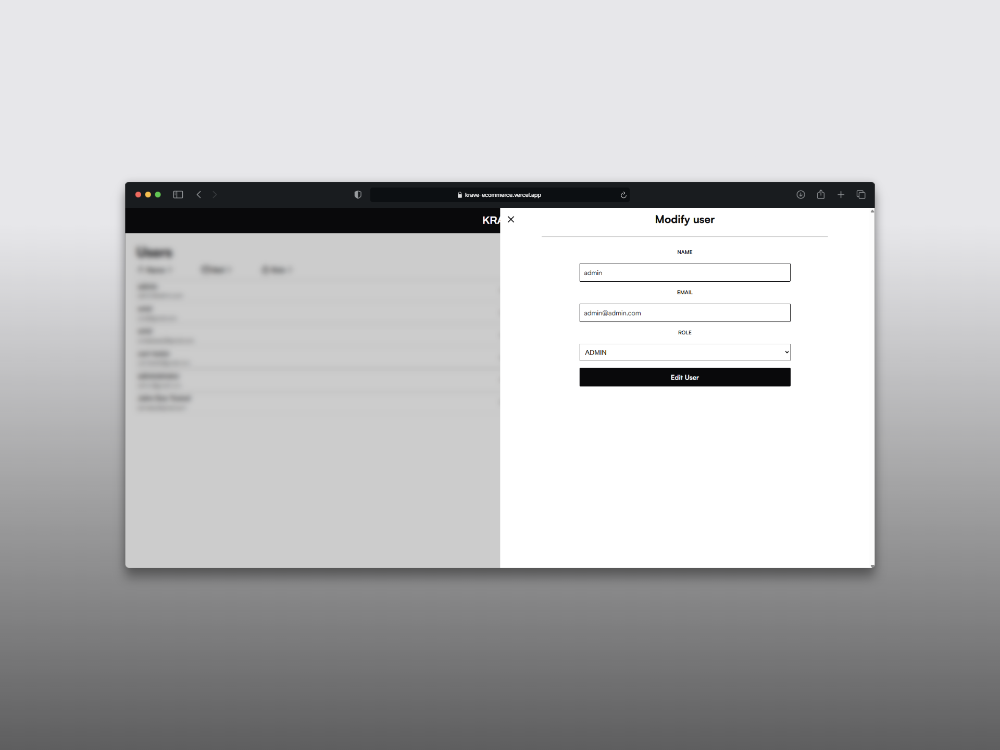
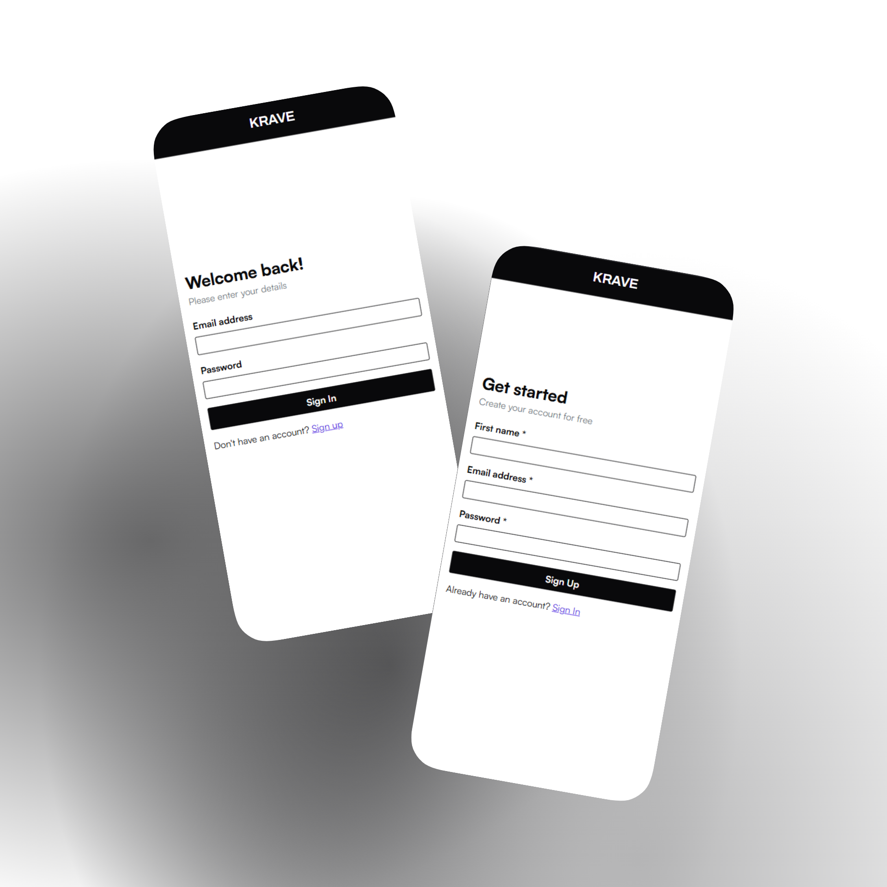
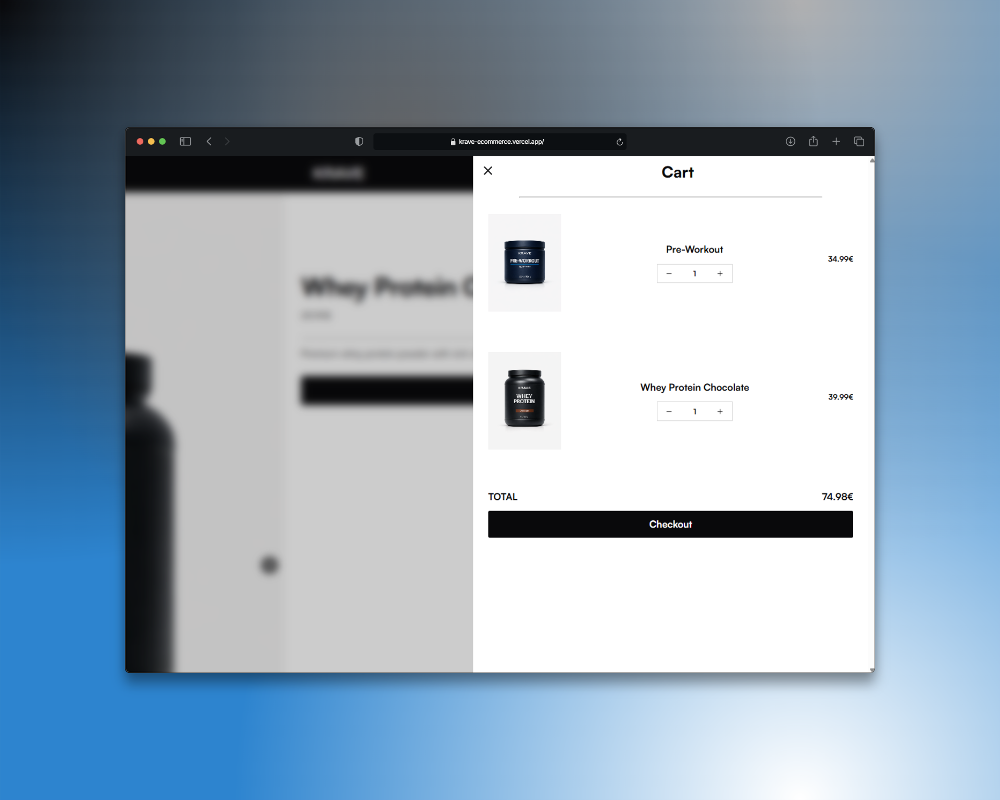
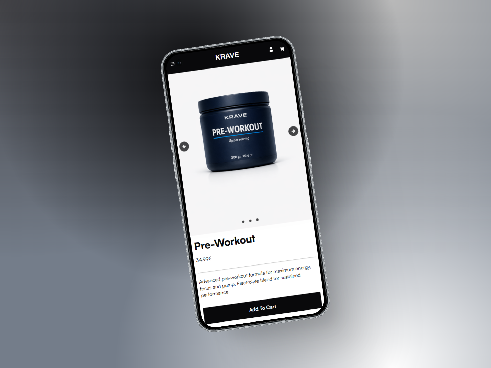

# 🍋 KRAVE - E-Commerce Platform



## 📌 Project Overview

**KRAVE** is a modern, full-stack e-commerce platform specializing in sports nutrition supplements. It provides a seamless shopping experience with user authentication, product browsing, shopping cart management, comprehensive admin features for user and product management, and a robust REST API backend. The application is built with Vue 3, TypeScript, and Express.js, featuring a PostgreSQL database for reliable data management and role-based access control.

### Key Features

- 🛒 **Shopping Cart System** - Add, update, and remove products from cart
- 🔐 **User Authentication** - Secure registration and login with JWT tokens
- 📦 **Product Management** - Full CRUD operations for products (Admin/Staff only)
- 👥 **User Management** - Admin dashboard for managing users, roles, and permissions
- 👤 **User Profiles** - Personalized user accounts with role assignment
- 🎨 **Responsive UI** - Mobile-first design with Vue 3 components
- 🔌 **REST API** - Complete API endpoints for products, users, cart, and auth operations
- 🛡️ **Role-Based Access Control** - Three-tier roles (Admin, Staff, Customer) with granular permissions
- 📄 **API Documentation** - Clean documentation of the app API REST made with Docusaurus [https://krave-ecommerce.vercel.app/docs](https://krave-ecommerce.vercel.app/docs "Open documentation")

---

## 🏗️ Project Structure

```
krave-ecommerce/
├── frontend/                    # Vue 3 + TypeScript frontend
│   ├── src/
│   │   ├── components/          # Reusable Vue components
│   │   │   ├── Navbar.vue      # Navigation bar with cart toggle
│   │   │   ├── ProductCard.vue # Product display component
│   │   │   ├── ProductImages.vue # Product image carousel
│   │   │   ├── HeroHome.vue    # Landing section
│   │   │   ├── UsersList.vue   # Admin user list with filters
│   │   │   ├── UsersFilters.vue # User filtering component
│   │   │   ├── ProductsMain.vue # Products main display
│   │   │   ├── OnlyLogoNavbar.vue # Minimal navbar variant
│   │   │   └── ProductImages.vue # Product image handler
│   │   ├── views/               # Page components
│   │   │   ├── HomeView.vue    # Products listing
│   │   │   ├── ProductView.vue # Product details
│   │   │   ├── LoginView.vue   # User login
│   │   │   ├── RegisterView.vue # User registration
│   │   │   ├── ProfileView.vue # User profile
│   │   │   ├── ManageUsersView.vue # Admin user management
│   │   │   ├── CreateProductView.vue # Product creation form
│   │   │   ├── EditProductView.vue # Product editing form
│   │   │   └── RenderProductsToEditView.vue # Product selection for editing
│   │   ├── services/            # API communication
│   │   │   ├── auth.fetcher.ts # Authentication API calls
│   │   │   ├── cart.fetcher.ts # Cart API calls
│   │   │   ├── products.fetcher.ts # Product API calls
│   │   │   └── users.fetcher.ts # User management API calls
│   │   ├── stores/              # Pinia state management
│   │   │   └── cartUi.store.ts # Cart UI state
│   │   ├── router/              # Vue Router configuration
│   │   ├── types/               # TypeScript interfaces
│   │   ├── styles/              # Global styles
│   │   └── main.ts             # Application entry point
│   ├── package.json
│   ├── vite.config.ts          # Vite configuration
│   └── tsconfig.json
│
├── backend/                     # Express.js API server
│   ├── index.js                # Main server file with all routes
│   ├── package.json
│   ├── db/
│   │   ├── init.sql            # Database schema and seed data
│   │   └── setupdb.js          # Database connection pool
│   ├── repository/              # Database layer
│   │   ├── authRepository.js    # User queries
│   │   ├── cartRepository.js    # Cart queries
│   │   ├── productsRepository.js # Product queries
│   │   └── usersRepository.js    # User management queries
│   ├── util/
│   │   └── api.helpers.js       # Utility functions
│   ├── middleware/
│   │   └── role.js              # Admin authorization middleware
│   ├── request.http             # HTTP test requests
│   └── tsconfig.json
│
├── .gitignore
├── COMMIT_RULES.md              # Git commit guidelines
└── README.md
```

---

## 🛠️ Tech Stack

### Frontend

- **Vue 3** - Progressive JavaScript framework
- **TypeScript** - Type-safe JavaScript
- **Vite** - Next-generation build tool
- **Pinia** - State management
- **Vue Router** - Client-side routing
- **CSS3** - Custom styling with CSS variables

### Backend

- **Node.js** - JavaScript runtime
- **Express.js** - Web application framework
- **PostgreSQL** - Relational database
- **JWT** - JSON Web Tokens for authentication
- **bcrypt** - Password hashing
- **CORS** - Cross-origin resource sharing

---

## 📊 Database Schema

```sql
-- Users table
CREATE TABLE users (
    id SERIAL PRIMARY KEY,
    email VARCHAR UNIQUE NOT NULL,
    password VARCHAR NOT NULL,
    name VARCHAR NOT NULL,
    role_id INT DEFAULT 2,
    created_at TIMESTAMP DEFAULT CURRENT_TIMESTAMP,
    FOREIGN KEY (role_id) REFERENCES roles(id)
);

-- Roles table
CREATE TABLE roles (
    id SERIAL PRIMARY KEY,
    name VARCHAR UNIQUE NOT NULL
);

-- Products table
CREATE TABLE products (
    id SERIAL PRIMARY KEY,
    name VARCHAR NOT NULL,
    description TEXT NOT NULL,
    price REAL NOT NULL CHECK (price > 0),
    main_image TEXT NOT NULL,
    hover_image TEXT,
    about_image TEXT,
    info_image TEXT,
    weight REAL
);

-- Shopping carts
CREATE TABLE cart (
    id SERIAL PRIMARY KEY,
    user_id INT NOT NULL UNIQUE,
    created_at TIMESTAMP DEFAULT CURRENT_TIMESTAMP,
    FOREIGN KEY (user_id) REFERENCES users(id)
);

-- Cart items
CREATE TABLE cart_items (
    id SERIAL PRIMARY KEY,
    cart_id INT NOT NULL,
    product_id INT NOT NULL,
    quantity INT DEFAULT 1,
    FOREIGN KEY (cart_id) REFERENCES cart(id),
    FOREIGN KEY (product_id) REFERENCES products(id)
);
```

### Database Relationships

- **1-to-1**: User ↔ Cart
- **Many-to-1**: User ↔ Roles
- **1-to-Many**: Cart ↔ Cart Items
- **1-to-Many**: Products ↔ Cart Items

### Available Roles

- **Admin (ID: 1)** - Full access to all features including user and product management
- **Staff (ID: 3)** - Can manage products but cannot manage users
- **Customer (ID: 2)** - Regular user with shopping capabilities only

---

## 🔌 API Endpoints

### Base URL

```
http://localhost:3000
```

### Products Endpoints

#### Get All Products

```http
GET /products
```

**Response (200 OK):**

```json
[
  {
    "id": 1,
    "name": "Whey Protein Chocolate",
    "description": "Premium whey protein powder with rich chocolate flavor. 25g of protein per serving.",
    "price": 39.99,
    "main_image": "https://i.ibb.co/fYX4Pw50/main-Chocolate-Protein.png",
    "hover_image": null,
    "about_image": null,
    "info_image": "https://i.ibb.co/R8Dh7LK/macros-Chocolate-Protein.png",
    "weight": 1000
  },
  {
    "id": 2,
    "name": "Whey Protein Vanilla",
    "description": "Premium whey protein powder with smooth vanilla flavor.",
    "price": 39.99,
    "main_image": "https://i.ibb.co/4gMxbHbK/main-Vanilla-Protein.png",
    "hover_image": null,
    "about_image": null,
    "info_image": "https://i.ibb.co/tTGWwvFm/macros-Vanilla-Protein.png",
    "weight": 1000
  }
]
```

#### Get Product by ID

```http
GET /products/:id
```

**Response (200 OK):**

```json
{
  "id": 1,
  "name": "Whey Protein Chocolate",
  "description": "Premium whey protein powder with rich chocolate flavor.",
  "price": 39.99,
  "main_image": "https://i.ibb.co/fYX4Pw50/main-Chocolate-Protein.png",
  "info_image": "https://i.ibb.co/R8Dh7LK/macros-Chocolate-Protein.png",
  "weight": 1000
}
```

#### Get Product by Slug

```http
GET /products/slug/:slug
```

**Response (200 OK):** Same as above

#### Create Product (Admin/Staff Only)

```http
POST /products
Content-Type: application/json

{
    "name": "New Supplement",
    "description": "Product description",
    "price": 29.99,
    "main_image": "https://example.com/image.png",
    "weight": 500
}
```

**Response (201 Created):**

```json
{
  "status": "success",
  "message": "created"
}
```

#### Update Product (Admin/Staff Only)

```http
PUT /products/:id
Content-Type: application/json

{
    "name": "Updated Product Name",
    "price": 34.99
}
```

**Response (200 OK):**

```json
{
  "status": "success",
  "message": "updated"
}
```

#### Delete Product (Admin/Staff Only)

```http
DELETE /products/:id
```

**Response (200 OK):**

```json
{
  "status": "success",
  "message": "deleted"
}
```

---

### User Management Endpoints



**Authentication Required:** Yes - Admin only

#### Get All Users

```http
GET /admin/users
```

**Response (200 OK):**

```json
[
  {
    "id": 1,
    "email": "admin@krave.com",
    "name": "Admin User",
    "role_id": 1,
    "role": "ADMIN"
  },
  {
    "id": 5,
    "email": "customer@example.com",
    "name": "John Doe",
    "role_id": 2,
    "role": "CUSTOMER"
  },
  {
    "id": 3,
    "email": "staff@krave.com",
    "name": "Staff Member",
    "role_id": 3,
    "role": "STAFF"
  }
]
```

#### Get User by ID

```http
GET /admin/users/:id
```

**Response (200 OK):**

```json
{
  "id": 5,
  "email": "customer@example.com",
  "name": "John Doe",
  "role_id": 2,
  "role": "CUSTOMER"
}
```

#### Create User (Admin Only)

```http
POST /admin/users
Content-Type: application/json

{
    "email": "newuser@example.com",
    "name": "New User",
    "pwd": "SecurePassword123",
    "role_id": 2
}
```

**Response (201 Created):**

```json
{
  "status": "success",
  "message": "created"
}
```

#### Edit User (Admin Only)



```http
PUT /admin/users/:id
Content-Type: application/json

{
    "email": "updated@example.com",
    "name": "Updated Name",
    "role_id": 3
}
```

**Note:** Password is NOT updated in PUT requests.

**Response (200 OK):**

```json
{
  "status": "success",
  "message": "updated"
}
```

#### Delete User (Admin Only)

```http
DELETE /admin/users/:id
```

**Response (200 OK):**

```json
{
  "status": "success",
  "message": "deleted"
}
```

---

### Authentication Endpoints



#### Register

```http
POST /register
Content-Type: application/json

{
    "email": "user@example.com",
    "pwd": "SecurePassword123",
    "name": "John Doe"
}
```

**Response (201 Created):**

```json
{
  "status": "success",
  "token": "eyJhbGciOiJIUzI1NiIsInR5cCI6IkpXVCJ9...",
  "message": "User created successfully"
}
```

**Error Response (500):**

```json
{
  "status": "error",
  "message": "User could not be created (maybe email already exists)",
  "error": true
}
```

#### Login

```http
POST /login
Content-Type: application/json

{
    "email": "user@example.com",
    "pwd": "SecurePassword123"
}
```

**Response (200 OK):**

```json
{
  "status": "success",
  "token": "eyJhbGciOiJIUzI1NiIsInR5cCI6IkpXVCJ9...",
  "message": "User logged successfully"
}
```

**Error Response (401):**

```json
{
  "status": "error",
  "message": "Credencials incorrectes",
  "error": true
}
```

#### Check Authentication Status

```http
GET /auth/me
```

**Response (200 OK):**

```json
{
  "loggedIn": true,
  "message": "User logged in",
  "user": {
    "user_id": 5,
    "mail": "user@example.com",
    "name": "John Doe",
    "role": "customer"
  }
}
```

#### Logout

```http
POST /logout
```

**Response (200 OK):**

```json
{
  "status": "success",
  "message": "Logged out successfully"
}
```

---

### Cart Endpoints



#### Get User Cart

```http
GET /cart
```

**Response (200 OK):**

```json
{
  "status": "success",
  "user_id": 5,
  "cart_id": 8,
  "items": [
    {
      "product_id": 1,
      "quantity": 2
    },
    {
      "product_id": 3,
      "quantity": 1
    }
  ]
}
```

#### Add Product to Cart

```http
POST /cart/items
Content-Type: application/json

{
    "product_id": 1
}
```

**Response (200 OK):**

```json
{
  "status": "success",
  "message": "added to cart"
}
```

#### Update Product Quantity in Cart

```http
PUT /cart/items/:productId
Content-Type: application/json

{
    "quantity": 3
}
```

**Response (200 OK):**

```json
{
  "status": "success",
  "message": "quantity modified"
}
```

#### Remove Product from Cart

```http
DELETE /cart/items/:productId
```

**Response (200 OK):**

```json
{
  "status": "success",
  "message": "product removed from cart"
}
```

#### Clear Entire Cart

```http
DELETE /cart
```

**Response (200 OK):**

```json
{
  "status": "success",
  "message": "cart emptied"
}
```

---

## 🚀 Installation & Setup

### Prerequisites

- Node.js (v16 or higher)
- PostgreSQL (v12 or higher)
- npm or yarn

### Frontend Setup

```bash
cd frontend
npm install
npm run dev
```

The frontend will be available at `http://localhost:5173`

### Backend Setup

```bash
cd backend
npm install
```

#### Environment Variables (.env)

```env
DB_HOST=localhost
DB_USER=postgres
DB_PASSWORD=your_password
DB_NAME=krave_ecommerce
DB_PORT=5432
JWT_SECRET=your_jwt_secret_key
NODE_ENV=development
```

#### Initialize Database

```bash
npm run db:init
```

#### Start Server

```bash
npm start
```

The API will be available at `http://localhost:3000`

---

## 📱 Key Components

### Frontend Components

#### Navbar

- Shopping cart toggle
- User profile link
- Menu navigation
- Real-time cart item count

#### ProductCard

- Product image with hover effect
- Product name and price
- Add to cart button
- Quick view functionality

#### ProductView



- Full product details
- Image carousel
- Specifications display
- Add to cart with quantity selector
- Related products

### Shopping Cart


- Item list with thumbnails
- Quantity adjustment
- Price calculation
- Remove items
- Checkout button

### User Management (Admin Only)


- View all users with detailed information
- Filter users by name, email, or role
- Sort by different criteria (name, email, role)
- Create new users with role assignment
- Edit user information (name, email, role)
- Delete users from the system
- User roles: Admin, Staff, Customer

---

## 🔐 Authentication & Security

- **JWT Tokens**: Secure token-based authentication
- **Password Hashing**: bcrypt algorithm for password encryption
- **Role-Based Access Control**: Admin, Staff, and Customer roles
- **CORS**: Restricted cross-origin requests
- **HTTP-only Cookies**: Secure token storage
- **Environment Variables**: Sensitive data protected

---

## 📦 API Response Format

All API responses follow a consistent format:

**Success Response:**

```json
{
  "status": "success",
  "message": "Operation completed",
  "data": {}
}
```

**Error Response:**

```json
{
  "status": "error",
  "message": "Error description",
  "error": true
}
```

---

## 🎨 UI/UX Features

- **Responsive Design**: Mobile-first approach
- **Loading States**: Skeleton screens during data fetching
- **Error Handling**: User-friendly error messages
- **Smooth Animations**: Transitions and hover effects
- **Accessibility**: Semantic HTML and ARIA labels

---

## 📈 Future Enhancements

- [x] Role-Based Access Control (RBAC)
- [x] Admin user management dashboard
- [x] Product CRUD for Admin/Staff
- [ ] Advanced search and filtering with full-text search
- [ ] Product reviews and ratings system
- [ ] Email notifications for orders
- [ ] Payment gateway integration
- [ ] Analytics dashboard
- [ ] Performance optimization and caching

---

## 👨‍💼 Author

**Oriol Plazas León**

---

## 📞 Support

For issues, questions, or contributions, please open an issue on the GitHub repository.

**Repository**: [krave-ecommerce](https://github.com/username/krave-ecommerce)
